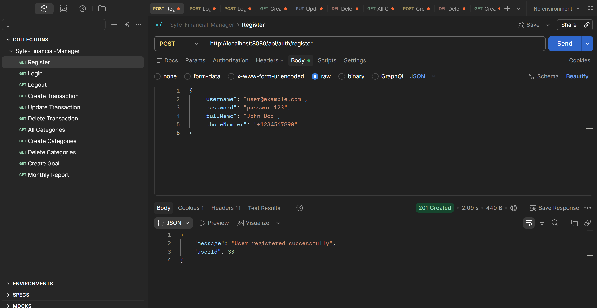
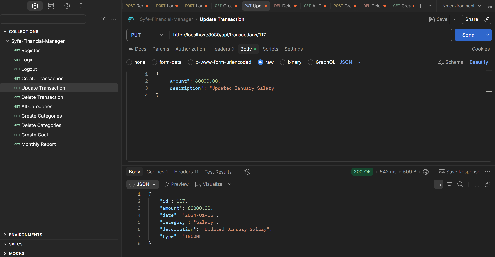
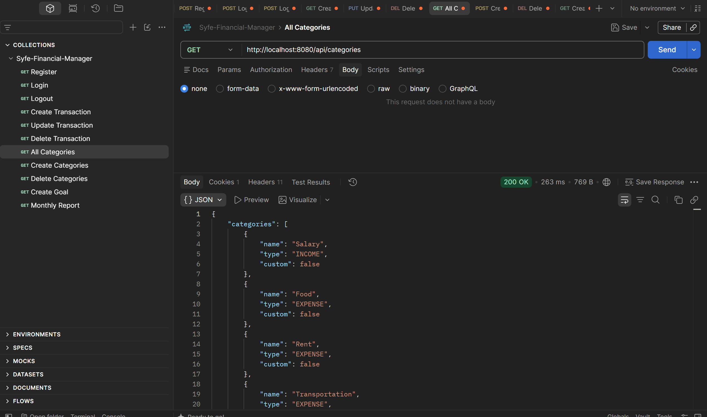
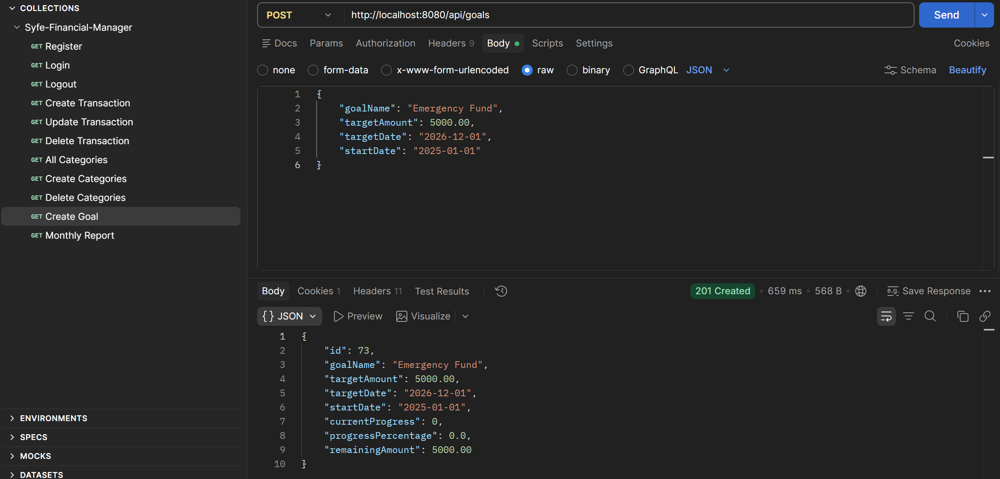
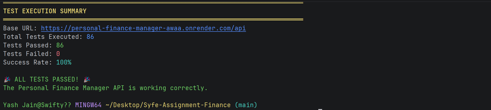

# Personal Finance Manager

A RESTful API built with **Spring Boot** and **PostgreSQL** that enables users to manage their personal finances — track income and expenses, categorize transactions, set savings goals, and generate detailed financial reports.

---

## Tech Stack

| Layer | Technology |
|-------|-----------|
| Language | Java 21 |
| Framework | Spring Boot 3.2.4 |
| Database | PostgreSQL (Supabase) |
| ORM | Spring Data JPA / Hibernate |
| Security | Spring Security (Session-based) |
| Build Tool | Maven |
| Deployment | Docker + Render |

---

## Features

- **User Authentication** — Register and login with session-based security
- **Transaction Management** — Full CRUD for income and expense transactions
- **Category Management** — System defaults + user-defined custom categories
- **Savings Goals** — Set financial targets and track real-time progress
- **Reports** — Monthly and yearly financial summaries with category breakdowns

---

## API Reference

### Authentication

#### Register
**`POST /api/auth/register`**

Request Body:
```json
{
  "username": "user@example.com",
  "password": "password123",
  "fullName": "John Doe",
  "phoneNumber": "+1234567890"
}
```
Success Response `201 Created`:
```json
{ "message": "User registered successfully", "userId": 1 }
```

---

#### Login
**`POST /api/auth/login`**

Request Body:
```json
{ "username": "user@example.com", "password": "password123" }
```
Success Response `200 OK`:
```json
{ "message": "Login successful" }
```

---

#### Logout
**`POST /api/auth/logout`**

Success Response `200 OK`:
```json
{ "message": "Logout successful" }
```

---

### Categories

#### Get All Categories
**`GET /api/categories`**

Success Response `200 OK`:
```json
{
  "categories": [
    { "name": "Salary", "type": "INCOME", "isCustom": false },
    { "name": "Food", "type": "EXPENSE", "isCustom": false },
    { "name": "Rent", "type": "EXPENSE", "isCustom": false },
    { "name": "Freelance", "type": "INCOME", "isCustom": true }
  ]
}
```

---

#### Create Custom Category
**`POST /api/categories`**

Request Body:
```json
{ "name": "Investments", "type": "INCOME" }
```
Success Response `201 Created`:
```json
{ "name": "Investments", "type": "INCOME", "isCustom": true }
```

---

#### Delete Custom Category
**`DELETE /api/categories/{name}`**

Success Response `200 OK`:
```json
{ "message": "Category deleted successfully" }
```

---

### Transactions

#### Create Transaction
**`POST /api/transactions`**

Request Body:
```json
{
  "amount": 5500.00,
  "date": "2024-01-15",
  "category": "Salary",
  "description": "January Main Salary"
}
```
Success Response `201 Created`:
```json
{
  "id": 1,
  "amount": 5500.00,
  "date": "2024-01-15",
  "category": "Salary",
  "description": "January Main Salary",
  "type": "INCOME"
}
```

---

#### Get Transactions (with filters)
**`GET /api/transactions?startDate=2024-01-01&endDate=2024-01-31&category=Salary`**

Success Response `200 OK`:
```json
{
  "transactions": [
    {
      "id": 1,
      "amount": 5500.00,
      "date": "2024-01-15",
      "category": "Salary",
      "description": "January Main Salary",
      "type": "INCOME"
    }
  ]
}
```

---

#### Update Transaction
**`PUT /api/transactions/{id}`**

Request Body:
```json
{ "amount": 6000.00, "description": "Updated Salary amount" }
```
---

#### Delete Transaction
**`DELETE /api/transactions/{id}`**

Success Response `200 OK`:
```json
{ "message": "Transaction deleted successfully" }
```

---

### Savings Goals

#### Create Goal
**`POST /api/goals`**

Request Body:
```json
{
  "goalName": "Emergency Fund",
  "targetAmount": 15000.00,
  "targetDate": "2028-01-01",
  "startDate": "2024-01-01"
}
```
Success Response `201 Created`:
```json
{
  "id": 1,
  "goalName": "Emergency Fund",
  "targetAmount": 15000.00,
  "targetDate": "2028-01-01",
  "startDate": "2024-01-01",
  "currentProgress": 5500.00,
  "progressPercentage": 36.7,
  "remainingAmount": 9500.00
}
```

---

### Reports

#### Monthly Report
**`GET /api/reports/monthly/{year}/{month}`**

Example: `GET /api/reports/monthly/2024/1`

Success Response `200 OK`:
```json
{
  "month": 1,
  "year": 2024,
  "totalIncome": { "Salary": 5500.00 },
  "totalExpenses": { "Food": 450.00 },
  "netSavings": 5050.00
}
```

---

#### Yearly Report
**`GET /api/reports/yearly/{year}`**

Example: `GET /api/reports/yearly/2024`

---

## API Screenshots

### User Registration & Login


### Transaction Management


### Category Management


### Savings Goals


    

---

## Testing

The project includes a comprehensive end-to-end test suite (`financial_manager_tests.sh`) that validates all API endpoints.

### Running the Tests

Make sure the application is running locally on port 8080, then execute:

```bash
chmod +x financial_manager_tests.sh
./financial_manager_tests.sh http://localhost:8080/api
```

### Test Coverage

Modules covered by the test suite:

- Authentication (Register, Login, Logout)
- Category CRUD
- Transaction CRUD + Filters
- Savings Goals + Progress Tracking
- Monthly & Yearly Reports

### Test Results



---

## Running Locally

### Prerequisites
- Java 21+
- PostgreSQL
- Maven

### Steps

1. **Clone the repository**
   ```bash
   git clone https://github.com/yashj-010/Personal_Finance_Manager.git
   cd Personal_Finance_Manager
   ```

2. **Set environment variables**
   ```bash
   export SPRING_DATASOURCE_URL=jdbc:postgresql://localhost:5432/finance_manager
   export SPRING_DATASOURCE_USERNAME=your_username
   export SPRING_DATASOURCE_PASSWORD=your_password
   ```

3. **Run the application**
   ```bash
   ./mvnw spring-boot:run
   ```

4. **API is available at** `http://localhost:8080/api`

---

## Running with Docker

```bash
docker-compose up --build
```

This will automatically start both the PostgreSQL database and the Spring Boot application.

---

## Live 

**Deployed on Render:** [https://personal-finance-manager-awaa.onrender.com](https://personal-finance-manager-awaa.onrender.com)

> **Note:** Hosted on Render's free tier — the first request may take ~30 seconds to wake up the server.